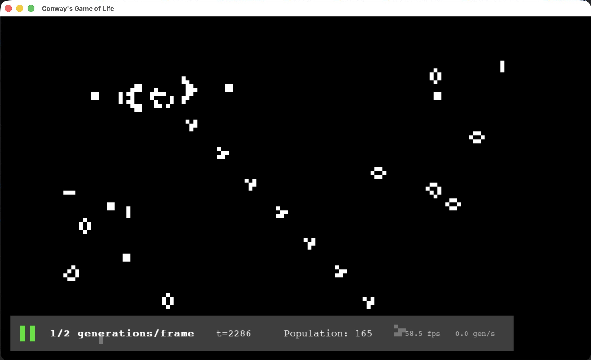
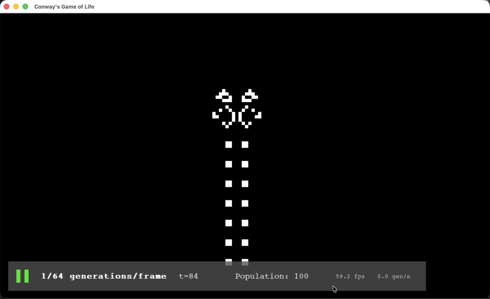
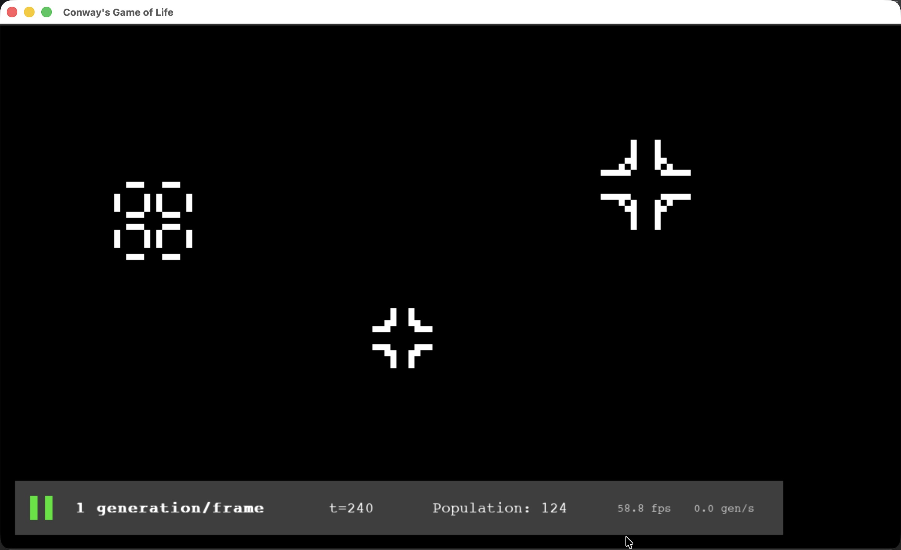

# Conway's Game of Life <sub><sup>(v1.0.1)</sup></sub>

A simple [Conway's Game of Life][wiki] simulator in Python, built using the 
`pygame-ce` framework.


## Game Info

- **Recommended Python version: >=3.14**
- Uses `pygame-ce` as primary game library
- Compatible with macOS, Windows, Linux, and more!
- Default maximum framerate (or tick rate) is 60 FPS
- Extremely light-weight and easy to use, with a simple UI and clean code
- Uses a strict OOP architecture (Everything on screen is controlled by
  a native object)
- Unfortunately, your CPU might get warm after a while...

## How to use

To install (if you have `pipx` installed):
```shell
pipx install git+https://github.com/TheGittyPerson/conways-game-of-life.git
```

To run:

```shell
conway-life
```

Simple!

---

The game starts with a blank screen in a paused state.

- `Left-click + Drag`: temporarily pause and draw (activate cells)
- `Right-click + Drag`: temporarily pause and erase (kill cells)

Key commands:
- `Space`: Pause/Unpause
- `▲` / `▶`: Increase game speed (generations per frame)
- `▼` / `◀`: Decrease game speed (generations per frame)
- `C`: Hide/Unhide control panel
- `R`: Reset grid (also resizes grid with more/fewer pixels if the window 
  was resized)
- `Q`: Quit

You can adjust settings in `settings.py`.

## Tips 💡

Main variables that affect speed:
- Number of cells to render (determined by window size and cell size)
- Cell population (number of living cells)
- Generations to compute per frame
- Your computer

Read more about Conway's Game of Life at [LifeWiki.com][wiki-main]

Here's a much better automaton if you're actually interested: https://conwaylife.com/

---

## Screenshots!

### [Gosper Glider Gun][ggg]



### [Pufferfish][puffer]



### [Pulsars][pulsars]



---

## License

This project is licensed under the [MIT License](LICENSE.txt).

[wiki]: https://conwaylife.com/wiki/Conway%27s_Game_of_Life
[wiki-main]: https://conwaylife.com/wiki/Main_Page
[ggg]: https://conwaylife.com/wiki/Gosper_glider_gun
[puffer]: https://conwaylife.com/wiki/Pufferfish
[pulsars]: https://conwaylife.com/wiki/Pulsar
[pygame-ce]: https://pyga.me/
