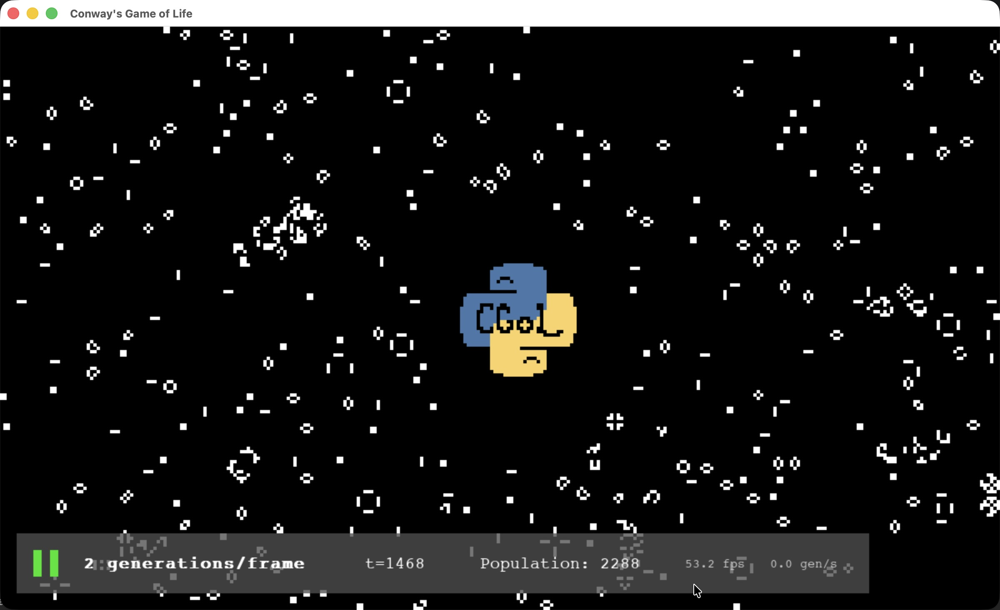

# Conway's Game of Life <sub><sup>(v1.0.0)</sup></sub>

A simple [Conway's Game of Life][wiki] in Python, built using the `pygame` 
library.



## Game Info

- Recommended Python version: >=3.14
- Uses `pygame-ce` as main game library
- Compatible with macOS, Windows, Linux, and more!
- Default maximum framerate (or tick rate) is 60 FPS
- Extremely light-weight and easy to use with a simple UI

## How to use

Before running, install requirements:
```shell
python -m pip install --upgrade pip
python -m pip install -r requirements.txt
```

To start, run:
```shell
cd path/to/directory  # Replace with parent directory of the `cgol` package
python -m cgol
```

Or:

```python
from cgol import ConwaysGameOfLife

cgol = ConwaysGameOfLife()
cgol.run()
```

Simple!

---

The game starts with a blank screen in a paused state.

- `Left-click + Drag`: temporarily pause and draw (activate cells)
- `Right-click + Drag`: temporarily pause and erase (kill cells)

Key commands:
- `Space`: Pause/Unpause
- `▲` / `▶`: Increase game speed (generations per frame)
- `▼` / `◀`: Decrease game speed (generations per frame)
- `C`: Hide/Unhide control panel
- `R`: Reset grid (also resizes grid with more/fewer pixels if the window 
  was resized)
- `Q`: Quit

You can adjust initial settings in `settings.py`.

## Tips

Variables that affect speed:
- Number of cells to render (determined by window size and cell size)
- Cell population
- Generations to compute per frame

---

## Screenshots!

### Gosper Glider Gun


### Pufferfish


### Pulsars


---

## License

This project is licensed under the [MIT License](LICENSE.txt).

[wiki]: https://conwaylife.com/wiki/Conway%27s_Game_of_Life
[pygame-ce]: https://pyga.me/
